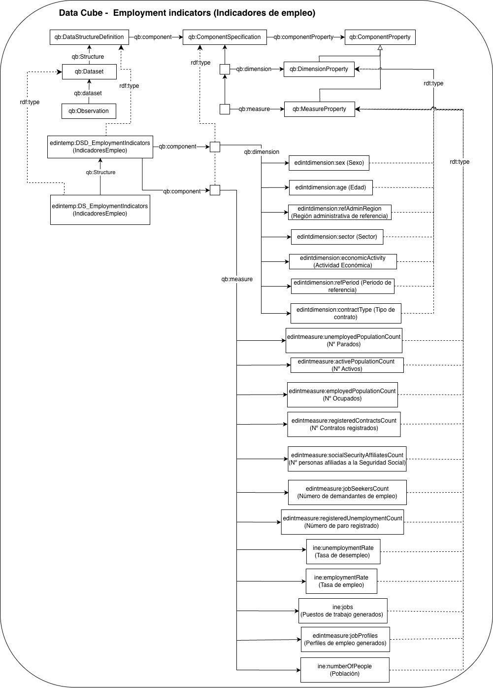

# Cubo de datos EDINT de Indicadores de Empleo (EDINT Employment  Indicators Data Cube)

Este recurso define un **cubo de datos RDF** para representar indicadores agregados relacionados con el **empleo** en función de distintas dimensiones, como la región administrativa, el periodo temporal, el sector, la actividad económica, el sexo, la edad y el tipo de contrato. El modelo se ha desarrollado siguiendo el vocabulario **RDF Data Cube**, lo que permite estructurar la información de forma interoperable, reutilizable y preparada para su consulta mediante SPARQL.

Este cubo de datos está siendo desarrollado en el contexto del Espacio de Datos para las Infraestructuras Urbanas Inteligentes ([EDINT](https://edint.es/)).

## Propósito y alcance del cubo de datos (Purpose and scope of the data cube)

El cubo de datos de empleo proporciona un modelo semántico para describir observaciones estadísticas vinculadas al mercado laboral. Cada observación combina un conjunto de dimensiones, territorio, tiempo, sector, actividad económica, sexo, edad y tipo de contrato, con una o varias medidas numéricas que representan diferentes indicadores de empleo.

El vocabulario reutiliza y extiende términos procedentes de estándares y recursos como **[RDF Data Cube](https://www.w3.org/TR/vocab-data-cube/)**, **[SDMX](https://sdmx.org/)**, **[Time Ontology](https://www.w3.org/TR/owl-time/)**, clasificaciones SKOS y vocabularios de administración pública, con el objetivo de favorecer la interoperabilidad con otros conjuntos de datos y modelos estadísticos.

El alcance de este cubo se centra en la representación de **observaciones agregadas de gasto comercial**. El modelo permite describir el gasto a partir de las siguientes dimensiones:

* **región administrativa de referencia** , como municipio, barrio o distrito;
* **periodo de referencia** , modelado como intervalo temporal;
* **sector;**
* **actividad económica** , representada mediante clasificaciones controladas CNAE;
* **nacionalidad** de los sujetos de la estadística.

Las medidas principales incluidas en el cubo son:

* **número de activos:** personas que forman parte de la población activa.
* **número de ocupados:** personas empleadas.
* **número de parados:** personas en situación de desempleo.
* **número de contratos registrados:** contratos de trabajo registrados.
* **número de demandantes de empleo:** personas registradas como demandantes de empleo.
* **número de paro registrado:** personas inscritas en situación de paro registrado según los registros administrativos del SEPE.
* **número de personas afiliadas a la Seguridad Social:** personas afiliadas al sistema de Seguridad Social.
* **tasa de desempleo:** cociente entre el número de parados y el de activos.
* **tasa de empleo:** cociente entre el número de ocupados y el de activos.
* **puestos de trabajo generados:** puestos de trabajo generados en sectores económicos específico.
* **perfiles de empleo generados:** perfiles de empleo generados en sectores económicos específicos.
* **población:** Cada uno de los elementos que forman parte de la población de personas.

# Prefijo y espacio de nombres (Prefix and namespace)

El prefijo del cubo de datos es **edintemp** y se encuentra publicada en el espacio de nombres: **[http://vocab.linkeddata.es/datosabiertos/def/actividad-economica/cubo-empleo#](http://vocab.linkeddata.es/datosabiertos/def/actividad-economica/cubo-empleo#)**

Las dimensiones se representan con el prefijo **edintdimension** y se encuentra en el espacio de nombres: **[http://vocab.linkeddata.es/datosabiertos/def/dimension#](http://vocab.linkeddata.es/datosabiertos/def/dimension#)**

Las medidas se representan con el prefijo **edintmeasure** y se encuentre en el espacio de nombres: **[http://vocab.linkeddata.es/datosabiertos/def/measure#](http://vocab.linkeddata.es/datosabiertos/def/measure#)**

# Modelo conceptual (Data cube conceptualization)

# Estructura del repositorio (Repository structure)

El repositorio contiene las siguientes carpetas

| Carpeta                       | Descripción                                                                                                                                        |
| ----------------------------- | --------------------------------------------------------------------------------------------------------------------------------------------------- |
| **diagrams/**           | Contiene diagramas y otros recursos que representan el modelo conceptual del cubo de datos (por ejemplo, las dimensiones y las medidas).           |
| **documentation/**      | Contiene la documentación del cubo de datos y artefactos relacionados en formato HTML o dirigida a usuarios.                                       |
| **kos/**                | Contiene la implementación de vocabularios controlados o KOS, generalmente implementaciones SKOS en RDF.                                           |
| **data-cube-ontology/** | Contiene los archivos de implementación del cubo de datos en formatos como .owl .                                                                  |
| **requirements/**       | Contiene todos los documentos utilizados para definir los requisitos del cubo de datos: preguntas de competencia y sus respectivas SPARQL queries. |

# Mantenimiento y evolución (Maintenance and evolution)

Para manejar las incidencias o mejoras sugeridas con respecto al cubo de datos, recomendamos seguir las guías proporcionadas en ([Issues Management](./ISSUES.md)) para generar una incidencia.

# Financiación (Funding)

Esta ontología ha sido desarrollada en el contexto del Espacio de Datos para las Infraestructuras Urbanas Inteligentes ([EDINT](https://edint.es)).

